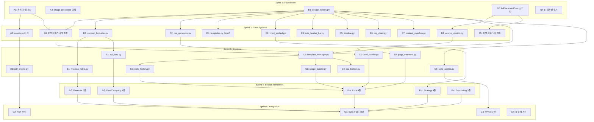
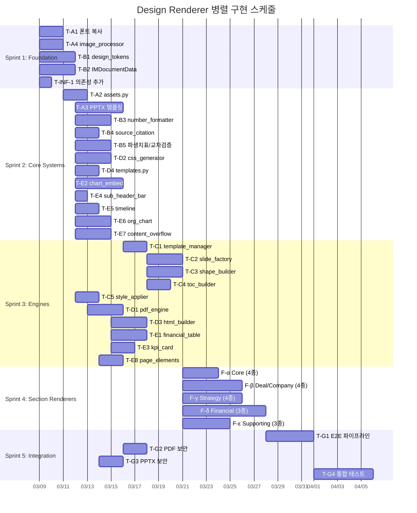

# Design Renderer 병렬화 구현 계획

> 작성일: 2026-02-08 12:46:56
> 최종 수정: 2026-02-10 21:04:09
> 기반 문서: `design-renderer-integration-plan.md`
> 상태: **✅ 전체 완료** (v0.4.0, 47개 티켓, 51+ 소스 파일, 107 tests)
>
> **Data Ingestor 진행상황**: Sprint 2 완료 (2026-02-09)
>
> **문서 관리 규칙**: 본 문서 업데이트 시 PowerShell `Get-Date -Format 'yyyy-MM-dd HH:mm:ss'`로 현재 시각을 확인하여 "최종 수정" 필드에 `yyyy-MM-dd HH:mm:ss` 형식으로 기재한다.

---

## 1. 병렬화 분석 요약

### 1-1. 기존 계획의 한계

기존 `design-renderer-integration-plan.md`는 Phase 1→2→3→4 순차 구조로 설계되었으나,
의존성 그래프 분석 결과 **상당수 작업이 병렬 수행 가능**하다.

| 항목 | 기존 계획 | 병렬화 계획 |
|------|---------|-----------|
| 구조 | 4 Phase (순차) | 7 워크스트림 × 5 스프린트 (병렬) |
| 총 태스크 | 17개 (3-1~3-17) | **47개 세부 티켓** |
| 예상 기간 | 7주 (W11~W17) | **5~6주 (W11~W16)** |
| 최대 동시 작업 | 1~3개 | **최대 18개** (Sprint 4) |

### 1-2. 핵심 발견

1. **`design_tokens.py`와 `IMDocumentData`는 순수 데이터 정의** → Phase 1과 동시 착수 가능
2. **PPTX 엔진과 PDF 엔진은 상호 독립** → 완전 병렬 개발 가능
3. **10개 공용 컴포넌트 중 6개는 `design_tokens`만 의존** → Sprint 2부터 즉시 착수
4. **18개 섹션 렌더러는 상호 독립** → 최대 병렬화 후보 (4개 그룹 분할)
5. **`number_formatter`와 `source_citation`은 조기 착수 가능** → 하위 의존 컴포넌트의 블로커 해소

---

## 2. 의존성 그래프

### 2-1. DAG (Directed Acyclic Graph)



### 2-2. 크리티컬 패스

```
A1(폰트) → A3(PPTX 템플릿) → C1(template_manager) → C2(slide_factory) → F(섹션 렌더러) → G1(E2E)
```

**크리티컬 패스 길이**: 6단계 (기존 순차 구조 대비 약 40% 단축)

---

## 3. 워크스트림 정의

### 워크스트림 A: 에셋/인프라 (4개 티켓)

폰트, 이미지, PPTX 마스터 템플릿 등 물리적 에셋과 유틸리티 이식.

| 티켓 | 의존성 | 스프린트 |
|------|--------|---------|
| A1 | 없음 | Sprint 1 |
| A2 | ← A1 | Sprint 2 |
| A3 | ← A1, B1 | Sprint 2 |
| A4 | 없음 | Sprint 1 |

### 워크스트림 B: 디자인/데이터 모델 (6개 티켓)

순수 데이터 정의(dataclass)와 포맷팅/유틸리티 모듈.

| 티켓 | 의존성 | 스프린트 |
|------|--------|---------|
| B1 | 없음 | Sprint 1 |
| B2 | 없음 | Sprint 1 |
| B3 | ← B1 | Sprint 2 |
| B4 | ← B2 | Sprint 2 |
| B5 | ← B2 | Sprint 2 |
| INF-1 | 없음 | Sprint 1 |

### 워크스트림 C: PPTX 엔진 (5개 티켓)

python-pptx 기반 슬라이드 생성 엔진.

| 티켓 | 의존성 | 스프린트 |
|------|--------|---------|
| C1 | ← A3, B1 | Sprint 3 |
| C2 | ← C1 | Sprint 3 |
| C3 | ← C1, B1 | Sprint 3 |
| C4 | ← C1, B1 | Sprint 3 |
| C5 | ← B1 | Sprint 3 |

### 워크스트림 D: PDF 엔진 (4개 티켓)

HTML→PDF 변환 파이프라인.

| 티켓 | 의존성 | 스프린트 |
|------|--------|---------|
| D1 | ← A2, B1 | Sprint 3 |
| D2 | ← B1 | Sprint 2 |
| D3 | ← D2, B1 | Sprint 3 |
| D4 | ← B1 | Sprint 2 |

### 워크스트림 E: 공용 컴포넌트 (10개 티켓)

PPTX/PDF 공용 재사용 컴포넌트.

| 티켓 | 의존성 | 스프린트 |
|------|--------|---------|
| E1 | ← B1, B3 | Sprint 3 |
| E2 | ← B1 | Sprint 2 |
| E3 | ← B1, B3 | Sprint 3 |
| E4 | ← B1 | Sprint 2 |
| E5 | ← B1 | Sprint 2 |
| E6 | ← B1 | Sprint 2 |
| E7 | ← B1 | Sprint 2 |
| E8 | ← B1, B4 | Sprint 3 |
| E9 | ← B1 | Sprint 2 |
| E10 | ← B1 | Sprint 2 |

### 워크스트림 F: 섹션 렌더러 (18개 티켓, 5개 그룹)

18개 섹션 렌더러는 상호 독립. 5개 난이도/유형별 그룹으로 분할.

| 그룹 | 티켓 | 의존성 | 스프린트 |
|------|------|--------|---------|
| F-α Core | F1~F4 | ← C2, C3, D3, E8 | Sprint 4 |
| F-β Deal/Company | F5~F8 | ← C2, C3, D3, E3, E5 | Sprint 4 |
| F-γ Strategy | F9~F12 | ← C2, C3, D3, E2, E4 | Sprint 4 |
| F-δ Financial | F13~F15 | ← C2, C3, D3, E1, E2 | Sprint 4 |
| F-ε Supporting | F16~F18 | ← C2, C3, D3, E6 | Sprint 4 |

### 워크스트림 G: 통합/보안 (4개 티켓)

E2E 파이프라인 조립, 보안 기능, 통합 테스트.

| 티켓 | 의존성 | 스프린트 |
|------|--------|---------|
| G1 | ← F 전체 | Sprint 5 |
| G2 | ← D1 | Sprint 5 |
| G3 | ← C5 | Sprint 5 |
| G4 | ← G1 | Sprint 5 |

---

## 4. 스프린트별 세부 티켓

---

### Sprint 1: Foundation (W11) — 5개 티켓, 전부 병렬 ✅ 완료 (2026-02-08)

> 의존성 없는 기반 작업. 모든 티켓을 동시 착수한다.
>
> **완료일**: 2026-02-08 13:08:12 — 5개 티켓 전부 구현 및 검증 완료.

---

#### T-A1: 폰트 파일 복사 ✅

| 항목 | 내용 |
|------|------|
| **워크스트림** | A: 에셋/인프라 |
| **기존 매핑** | 3-1 |
| **의존성** | 없음 |
| **설명** | Radar 프로젝트에서 AMIC 폰트 10개 파일을 `src/design_renderer/assets/fonts/`로 복사 |
| **산출물** | `assets/fonts/` 디렉토리 + Inter-Variable.ttf, Pretendard×4, IBMPlexMono×4, NotoSansKR-Variable.ttf |
| **소스** | `Deal & Regulation Radar/radar/reporting/assets/fonts/` |
| **검증** | 파일 존재 확인, 폰트 파일 무결성 (fontTools로 로드 테스트) |
| **상태** | **완료** (2026-02-08) — 10개 파일 복사 완료, `ls` 확인 |

---

#### T-A4: image_processor.py 이식 ✅

| 항목 | 내용 |
|------|------|
| **워크스트림** | A: 에셋/인프라 |
| **기존 매핑** | 3-3 |
| **의존성** | 없음 |
| **설명** | Radar `image_processor.py` 복사 + `max_width`/`max_height` 파라미터화 + `embed_local_image()` 추가 |
| **산출물** | `src/design_renderer/image_processor.py` |
| **소스** | `Deal & Regulation Radar/radar/reporting/image_processor.py` |
| **검증** | 이미지 다운로드/리사이즈 단위 테스트, 로컬 이미지 임베딩 테스트 |
| **상태** | **완료** (2026-02-08) — `embed_local_image()` + `embed_local_image_with_size()` 추가, import 검증 |

---

#### T-B1: design_tokens.py 생성 ✅

| 항목 | 내용 |
|------|------|
| **워크스트림** | B: 디자인/데이터 모델 |
| **기존 매핑** | 3-6 |
| **의존성** | 없음 |
| **설명** | `IMDesignTokens` dataclass 정의. AMIC 컬러 (`#0F3A32`, `#26C260`, `#3D3D3D`), 폰트 체계 (Inter/Pretendard/IBM Plex Mono/Noto Sans KR/NanumGothic), TITAN/COVENANT 레이아웃 수치 (10.83"×7.5", 여백, 콘텐츠 영역, 폰트 사이즈 체계), `from_brand_assets()` 팩토리 메서드 |
| **산출물** | `src/design_renderer/design_tokens.py` |
| **패턴 참조** | `Deal & Regulation Radar/radar/reporting/amic_design_tokens.py` (dataclass 구조 차용) |
| **검증** | 기본값 유효성, 브랜드 오버라이드 테스트, PPTX/PDF 토큰 공유 확인 |
| **상태** | **완료** (2026-02-08) — 5개 sub-dataclass (IMColorPalette, IMTypography, IMFontSizes, IMPageLayout, IMPPTXLayouts) + `from_brand_assets()`, `DEFAULT_TOKENS` 싱글턴 |

---

#### T-B2: IMDocumentData 입력 스키마 정의 ✅

| 항목 | 내용 |
|------|------|
| **워크스트림** | B: 디자인/데이터 모델 |
| **기존 매핑** | 3-14 |
| **의존성** | 없음 |
| **설명** | 모든 렌더러의 입력이 되는 통합 데이터 모델. 기본 정보, 섹션 구성, 재무 데이터, 딜 구조, 정성 데이터, 인적 자원, AI 내러티브, 브랜딩, 차트 데이터, 숫자 표기 설정, 출처 메타데이터, 파생 지표 필드를 모두 포함하는 `IMDocumentData` dataclass 정의 |
| **산출물** | `src/design_renderer/im_document.py` |
| **검증** | 필수 필드 누락 시 에러, TITAN/COVENANT 양식 모두 표현 가능한지 확인 |
| **상태** | **완료** (2026-02-08) — 14개 sub-dataclass, TITAN(9)/COVENANT(10)/FULL(18) 프리셋, `compute_derived_metrics()` (9개 지표), `validate_consistency()` 구현 |

---

#### T-INF-1: 의존성 추가 + 프로젝트 구조 업데이트 ✅

| 항목 | 내용 |
|------|------|
| **워크스트림** | B: 디자인/데이터 모델 |
| **기존 매핑** | 3-5 |
| **의존성** | 없음 |
| **설명** | `requirements.txt`에 신규 패키지 추가 (`fonttools>=4.47.0`, `brotli>=1.1.0`, `graphviz>=0.20.3`), 기존 패키지 버전 호환성 확인, `setup_project.py`의 `DIRECTORIES` 리스트에 `src/design_renderer/` 하위 서브패키지 구조 반영 |
| **산출물** | `requirements.txt` (수정), `setup_project.py` (수정), `src/design_renderer/__init__.py` |
| **검증** | `pip install -r requirements.txt` 성공, 디렉토리 구조 생성 확인 |
| **상태** | **완료** (2026-02-08) — `fonttools`, `brotli` 추가 (`graphviz`는 기존 존재), `components/`, `pptx_engine/`, `pdf_output/`, `section_renderers/` 패키지 + `__init__.py` 생성 |

---

### Sprint 2: Core Systems (W11~W12) — 최대 12개 티켓 병렬 ✅ 완료 (2026-02-08)

> Sprint 1 완료 항목에만 의존하는 작업. 워크스트림별로 동시 진행한다.
>
> **완료일**: 2026-02-08 20:31:11 — 12개 티켓 전부 구현 완료 (T-B5는 Sprint 1에서 이미 구현).

---

#### T-A2: assets.py 이식 ✅

| 항목 | 내용 |
|------|------|
| **워크스트림** | A: 에셋/인프라 |
| **기존 매핑** | 3-2 |
| **의존성** | ← T-A1 |
| **설명** | Radar `assets.py` 복사 → `IMAGE_FILES`를 AMIC 로고/커버 이미지로 교체, 폰트 로직 (`generate_font_face_css()`, `_compress_font_to_woff2()`) 100% 유지, AMIC 브랜딩 이미지 (`amic_cover_bg.jpeg`, `amic_logo_dark.png`, `amic_logo_white.png`) 배치 |
| **산출물** | `src/design_renderer/assets.py`, `assets/images/` 디렉토리 + AMIC 이미지 파일 |
| **검증** | 폰트 CSS 생성, WOFF2 압축, 이미지 base64 인코딩 테스트 |
| **상태** | **완료** (2026-02-08) — PRETENDARD_FONTS 4개 웨이트, IMAGE_FILES 3개 AMIC 이미지, 7개 함수 100% 이식 |

---

#### T-A3: PPTX 마스터 템플릿 생성 ✅

| 항목 | 내용 |
|------|------|
| **워크스트림** | A: 에셋/인프라 |
| **기존 매핑** | 3-4 |
| **의존성** | ← T-A1, T-B1 |
| **설명** | TITAN PPTX에서 SL Template의 슬라이드 마스터/레이아웃 3종 (COVER, BLANK, MAIN) 추출, python-pptx로 `amic_im_template.pptx` 생성. 플레이스홀더 idx 체계 동일 (11=제목, 12=각주, 13=페이지번호), 테마 폰트 교체 (Outfit→Inter), 테마 컬러 교체 (SL Navy→AMIC Dark Green), AMIC 로고 삽입 |
| **산출물** | `assets/templates/amic_im_template.pptx` + `pptx_engine/create_template.py` |
| **소스** | `sample IM/TITAN - IM - vF 251201.pptx` |
| **검증** | PowerPoint에서 열어 3종 레이아웃 확인, AMIC 폰트/컬러 적용 확인 |
| **상태** | **완료** (2026-02-08) — from-scratch 방식, XML 레벨 테마 폰트/컬러 설정, MAIN 레이아웃에 idx=12/13 플레이스홀더 추가, `get_layout_by_purpose()` 헬퍼 |

---

#### T-B3: number_formatter.py 생성 ✅

| 항목 | 내용 |
|------|------|
| **워크스트림** | B: 디자인/데이터 모델 |
| **기존 매핑** | 3-15 |
| **의존성** | ← T-B1 |
| **설명** | `NumberFormatConfig` dataclass + 숫자 표기 규칙 엔진 구현. 단위 통일 (억원/$M), 천단위 구분, 소수점 반올림, 유효숫자, 조건부 포맷팅 (양수=녹색↑, 음수=적색↓), 통화 기호 관리. API: `format_currency()`, `format_percentage()`, `format_growth_indicator()`, `format_number()`, `apply_table_number_format()` |
| **산출물** | `src/design_renderer/components/number_formatter.py` |
| **검증** | KRW/USD 포맷, 천단위, 소수점, 조건부 색상, 테이블 일괄 적용 단위 테스트 |
| **상태** | **완료** (2026-02-08) — 5개 공개 API + 내부 헬퍼 3개, None/NaN/Inf 처리, ▲/▼ 성장지표 |

---

#### T-B4: source_citation.py 생성 ✅

| 항목 | 내용 |
|------|------|
| **워크스트림** | B: 디자인/데이터 모델 |
| **기존 매핑** | 3-16 |
| **의존성** | ← T-B2 |
| **설명** | `SourceCitation` dataclass + 출처 메타데이터→각주 자동 생성 모듈. API: `format_footnote()`, `assign_footnote_numbers()`, `render_footnote_pptx()`, `render_footnote_html()` |
| **산출물** | `src/design_renderer/components/source_citation.py` |
| **검증** | 각주 번호 매핑, PPTX/HTML 각주 렌더링, 빈 출처 처리 테스트 |
| **상태** | **완료** (2026-02-08) — 중복 출처 동일 번호, PPTX idx=12 플레이스홀더 렌더링, HTML `<div class="slide-footnote">` |

---

#### T-B5: 파생 지표 + 교차검증 로직 ✅

| 항목 | 내용 |
|------|------|
| **워크스트림** | B: 디자인/데이터 모델 |
| **기존 매핑** | 3-17 |
| **의존성** | ← T-B2 |
| **설명** | `IMDocumentData`에 `compute_derived_metrics()` (CAGR, YoY, 마진율 일괄 계산) + `validate_consistency()` (렌더링된 슬라이드 간 동일 지표 값 불일치 검출) 구현. 지연 바인딩 패턴 적용 |
| **산출물** | `src/design_renderer/im_document.py` (T-B2에서 생성한 파일에 메서드 추가) |
| **검증** | 파생 지표 계산 정확성, 의도적 불일치 데이터로 검출 테스트 |
| **상태** | **완료** (2026-02-08, Sprint 1에서 T-B2와 함께 구현) — `compute_derived_metrics()` 9개 지표, `validate_consistency()` 이미 `im_document.py`에 포함 |

---

#### T-D2: css_generator.py 생성 ✅

| 항목 | 내용 |
|------|------|
| **워크스트림** | D: PDF 엔진 |
| **기존 매핑** | 3-9 |
| **의존성** | ← T-B1 |
| **설명** | TITAN/COVENANT 레이아웃을 HTML/CSS로 재현. `@page { size: 10.83in 7.5in; }`, 리셋/12-column 그리드/인쇄 규칙 (Radar 재사용), TITAN 패턴 CSS 신규 (`.slide`, `.slide-title`, `.sub-header-bar`, `.summary-text`, `.content-area`, `.slide-footer`, `.toc-slide`) |
| **산출물** | `src/design_renderer/pdf_output/css_generator.py` |
| **검증** | CSS 출력 유효성, 페이지 크기 설정, 모든 클래스 정의 확인 |
| **상태** | **완료** (2026-02-08) — 12개 서브함수, 토큰 기반 동적 CSS, Cover/TOC/Contact/Table/Chart/Grid/Print 전체 구현 |

---

#### T-D4: templates.py (Jinja2 관리) 생성 ✅

| 항목 | 내용 |
|------|------|
| **워크스트림** | D: PDF 엔진 |
| **기존 매핑** | templates.py |
| **의존성** | ← T-B1 |
| **설명** | Jinja2 템플릿 환경 설정, 공통 템플릿 필터/함수 등록, 디자인 토큰 기반 템플릿 변수 바인딩 |
| **산출물** | `src/design_renderer/templates.py` |
| **검증** | Jinja2 환경 초기화, 커스텀 필터 동작 확인 |
| **상태** | **완료** (2026-02-08) — `create_jinja_env()`, 글로벌 변수 8개, 커스텀 필터 5개 (format_currency, format_pct, korean_number, safe_text, growth_color) |

---

#### T-E2: chart_embed.py 생성 ✅

| 항목 | 내용 |
|------|------|
| **워크스트림** | E: 공용 컴포넌트 |
| **기존 매핑** | 3-11a |
| **의존성** | ← T-B1 |
| **설명** | Plotly/Kaleido 기반 금융 차트 6종 생성 모듈. Waterfall (영업이익 Bridge), Dual-Axis Combo (매출+이익률), Stacked Bar (사업부별 매출), Donut (시장 점유율), Line Multi-series (KPI 추이), Horizontal Bar (경쟁사 비교). API: `create_waterfall_chart()`, `create_combo_chart()`, `create_chart()`, `embed_chart_pptx()`, `embed_chart_html()`. AMIC 컬러 팔레트 적용, 한글 축 라벨 NanumGothic |
| **산출물** | `src/design_renderer/components/chart_embed.py` |
| **검증** | 6종 차트 렌더링, AMIC 컬러 적용, 300DPI PNG 출력, 한글 축 라벨 확인 |
| **상태** | **완료** (2026-02-08) — 6종 차트 + 디스패처 `create_chart()`, `_apply_amic_layout()` 공통 스타일, PPTX/HTML 임베딩, 10색 AMIC 컬러 시퀀스 |

---

#### T-E4: sub_header_bar.py 생성 ✅

| 항목 | 내용 |
|------|------|
| **워크스트림** | E: 공용 컴포넌트 |
| **기존 매핑** | 3-11 (sub_header_bar) |
| **의존성** | ← T-B1 |
| **설명** | TITAN 패턴의 컬러 서브헤더 직사각형 (AMIC 다크그린 bg + 12pt Bold White 텍스트). PPTX/HTML 듀얼 렌더링 |
| **산출물** | `src/design_renderer/components/sub_header_bar.py` |
| **검증** | PPTX shape 생성, HTML 렌더링, AMIC 컬러 적용 확인 |
| **상태** | **완료** (2026-02-08) — MSO_SHAPE.RECTANGLE PPTX, `<div class="sub-header-bar">` HTML, html.escape 적용 |

---

#### T-E5: timeline.py 생성 ✅

| 항목 | 내용 |
|------|------|
| **워크스트림** | E: 공용 컴포넌트 |
| **기존 매핑** | 3-11 (timeline) |
| **의존성** | ← T-B1 |
| **설명** | 기업 연혁 타임라인 시각화. Matplotlib/SVG 기반, 연도별 이벤트 수평/수직 배치, PPTX/PDF 듀얼 출력 |
| **산출물** | `src/design_renderer/components/timeline.py` |
| **검증** | 타임라인 SVG/PNG 생성, PPTX/PDF 삽입 테스트 |
| **상태** | **완료** (2026-02-08) — Agg 백엔드, 수평/수직 타임라인, PNG 300DPI (PPTX), SVG 인라인 (HTML), 한글 폰트 자동 감지 |

---

#### T-E6: org_chart.py 생성 ✅

| 항목 | 내용 |
|------|------|
| **워크스트림** | E: 공용 컴포넌트 |
| **기존 매핑** | 3-11 (org_chart) |
| **의존성** | ← T-B1 |
| **설명** | Graphviz DOT→SVG/PNG 기반 지배구조도/조직도 생성. PPTX: PNG 삽입, PDF: SVG 인라인 |
| **산출물** | `src/design_renderer/components/org_chart.py` |
| **검증** | Graphviz 렌더링, PPTX/PDF 삽입 테스트, 한글 노드 라벨 확인 |
| **상태** | **완료** (2026-02-08) — level별 노드 스타일링, TB/LR rankdir, SVG pipe() + `<ul>` fallback, NanumGothic 한글 라벨 |

---

#### T-E7: content_overflow.py 생성 ✅

| 항목 | 내용 |
|------|------|
| **워크스트림** | E: 공용 컴포넌트 |
| **기존 매핑** | 3-13 |
| **의존성** | ← T-B1 |
| **설명** | 콘텐츠 오버플로우 감지 및 자동 분할. API: `estimate_content_height()`, `split_content_to_slides()`, `auto_adjust_font_size()`. 전략: 자동 분할 (다음 슬라이드 + "cont'd"), 폰트 축소 (10pt→9pt→8pt, 7pt 하한), 테이블 행 분할 (헤더 반복), 차트 높이 제한 (60%) |
| **산출물** | `src/design_renderer/components/content_overflow.py` |
| **검증** | 높이 초과 감지, 자동 분할, 폰트 축소 하한(7pt) 준수 확인 |
| **상태** | **완료** (2026-02-08) — ContentBlock/SlideContent dataclass, 7pt 하한, 테이블 헤더 반복 분할, 자연 구분점 우선 |

---

#### T-E9: __init__.py + 패키지 구조 ✅

| 항목 | 내용 |
|------|------|
| **워크스트림** | E: 공용 컴포넌트 |
| **기존 매핑** | — (인프라) |
| **의존성** | ← T-B1 |
| **설명** | `components/__init__.py`, `pptx_engine/__init__.py`, `pdf_output/__init__.py`, `pdf_output/section_renderers/__init__.py` 생성 및 공개 API 정의 |
| **산출물** | 각 패키지의 `__init__.py` |
| **검증** | import 정상 동작 확인 |
| **상태** | **완료** (2026-02-08) — `components/` 30개 re-export, `pdf_output/` 1개, `pptx_engine/` 2개, `design_renderer/` 9개 공개 API, 버전 0.2.0 |

---

#### T-E10: 브랜딩 이미지 배치 ✅

| 항목 | 내용 |
|------|------|
| **워크스트림** | E: 공용 컴포넌트 |
| **기존 매핑** | — (에셋) |
| **의존성** | ← T-B1 |
| **설명** | AMIC 브랜딩 이미지 (`amic_cover_bg.jpeg`, `amic_logo_dark.png`, `amic_logo_white.png`) 확보 및 `assets/images/` 배치 |
| **산출물** | `assets/images/` 디렉토리 + 3개 이미지 파일 |
| **검증** | 이미지 파일 존재 및 해상도 확인 |
| **상태** | **완료** (2026-02-08) — Radar에서 복사 및 이름 변경 (logo_amic_dark→amic_logo_dark, logo_combined_white→amic_logo_white, cover_bg→amic_cover_bg) |

---

### Sprint 3: Engines + Dependent Components (W12~W13) — 최대 11개 티켓 병렬 ✅ 완료 (2026-02-08)

> PPTX 엔진과 PDF 엔진을 **완전 병렬**로 구축 + Sprint 2의 number_formatter/source_citation에 의존하는 컴포넌트 완성.
>
> **완료일**: 2026-02-08 20:57:50 — 10개 티켓 전부 구현 및 통합 검증 완료.

---

#### T-C1: template_manager.py 생성 ✅

| 항목 | 내용 |
|------|------|
| **워크스트림** | C: PPTX 엔진 |
| **기존 매핑** | 3-8 (template_manager) |
| **의존성** | ← T-A3, T-B1 |
| **설명** | `amic_im_template.pptx` 로드, COVER/BLANK/MAIN 레이아웃 참조 반환, 플레이스홀더 접근 API |
| **산출물** | `src/design_renderer/pptx_engine/template_manager.py` |
| **검증** | 템플릿 로드, 3종 레이아웃 참조 반환, 플레이스홀더 idx 접근 테스트 |
| **상태** | **완료** (2026-02-08) — TemplateManager 클래스, new_presentation(), get_layout(), add_slide(), get_placeholder(), set_placeholder_text() API |

---

#### T-C2: slide_factory.py 생성 ✅

| 항목 | 내용 |
|------|------|
| **워크스트림** | C: PPTX 엔진 |
| **기존 매핑** | 3-8 (slide_factory) |
| **의존성** | ← T-C1 |
| **설명** | API: `add_cover_slide()`, `add_disclaimer_slide()`, `add_toc_divider()`, `add_content_slide()`, `add_contact_slide()`. 각 레이아웃별 슬라이드 생성 + 플레이스홀더 값 주입 |
| **산출물** | `src/design_renderer/pptx_engine/slide_factory.py` |
| **검증** | Cover/TOC/Main/Contact 슬라이드 생성, 플레이스홀더 값 주입 확인 |
| **상태** | **완료** (2026-02-08) — SlideFactory 클래스, 5종 슬라이드 생성 API, AMIC 로고 자동 삽입, 연락처 그리드 배치 |

---

#### T-C3: shape_builder.py 생성 ✅

| 항목 | 내용 |
|------|------|
| **워크스트림** | C: PPTX 엔진 |
| **기존 매핑** | 3-8 (shape_builder) |
| **의존성** | ← T-C1, T-B1 |
| **설명** | API: `add_summary_textbox()` (14pt Bold), `add_sub_header_bar()` (컬러 직사각형+12pt Bold White), `add_body_textbox()` (10pt), `add_financial_table()` (col1=2.6"+7×0.91"), `add_kpi_grid()`, `add_chart_image()`. TITAN/COVENANT shape 패턴 재현 |
| **산출물** | `src/design_renderer/pptx_engine/shape_builder.py` |
| **검증** | 각 shape 유형 생성, 좌표/크기 정확성, AMIC 스타일 적용 확인 |
| **상태** | **완료** (2026-02-08) — 7개 공개 API (summary_textbox, sub_header_bar, body_textbox, bullet_list, chart_image, kpi_grid, financial_table), financial_table/kpi_card 컴포넌트 위임 패턴 |

---

#### T-C4: toc_builder.py 생성 ✅

| 항목 | 내용 |
|------|------|
| **워크스트림** | C: PPTX 엔진 |
| **기존 매핑** | 3-8 (toc_builder) |
| **의존성** | ← T-C1, T-B1 |
| **설명** | TOC 구분 슬라이드 생성 (BLANK 레이아웃). 2열 테이블 (번호+섹션명), 현재 섹션 ALL CAPS 하이라이트, AMIC 컬러 적용 |
| **산출물** | `src/design_renderer/pptx_engine/toc_builder.py` |
| **검증** | TOC 슬라이드 생성, 현재 섹션 하이라이트, 다중 섹션 구성 테스트 |
| **상태** | **완료** (2026-02-08) — build_toc_slide() PPTX + build_toc_slide_html() HTML 듀얼, SECTION_DISPLAY_NAMES 14개 매핑, 좌측 accent 하이라이트 바 |

---

#### T-C5: style_applier.py 생성 ✅

| 항목 | 내용 |
|------|------|
| **워크스트림** | C: PPTX 엔진 |
| **기존 매핑** | 3-8 (style_applier) |
| **의존성** | ← T-B1 |
| **설명** | AMIC 폰트/컬러를 모든 run에 일괄 적용. 텍스트 스타일 표준화, 편집 제한 모드 설정 |
| **산출물** | `src/design_renderer/pptx_engine/style_applier.py` |
| **검증** | 폰트/컬러 일괄 적용, run-level 스타일 확인 |
| **상태** | **완료** (2026-02-08) — apply_run_style(), apply_slide_style(), apply_presentation_style(), set_edit_restriction(), placeholder idx별 차등 스타일 |

---

#### T-D1: pdf_engine.py 생성 ✅

| 항목 | 내용 |
|------|------|
| **워크스트림** | D: PDF 엔진 |
| **기존 매핑** | 3-7 |
| **의존성** | ← T-A2, T-B1 |
| **설명** | Radar `amic_report.py:1264-1352`에서 추출. Playwright 우선 + WeasyPrint 폴백 이중엔진. 기본값 Landscape Letter (10.83"×7.5"). 폰트 WOFF2 base64 임베딩 |
| **산출물** | `src/design_renderer/pdf_engine.py` |
| **검증** | Playwright/WeasyPrint 각각 변환 테스트, 페이지 크기 확인 |
| **상태** | **완료** (2026-02-08) — generate_pdf() 공개 API, engine="auto"/"playwright"/"weasyprint" 선택, output_path 자동 디렉토리 생성 |

---

#### T-D3: html_builder.py 생성 ✅

| 항목 | 내용 |
|------|------|
| **워크스트림** | D: PDF 엔진 |
| **기존 매핑** | 3-10 (html_builder) |
| **의존성** | ← T-D2, T-B1 |
| **설명** | 전체 HTML 문서 조립. CSS 삽입, 섹션별 HTML 연결, 페이지 번호 처리, 폰트 base64 인라인 |
| **산출물** | `src/design_renderer/pdf_output/html_builder.py` |
| **검증** | HTML 조립 완전성, CSS 포함 확인, 유효한 HTML5 출력 |
| **상태** | **완료** (2026-02-08) — build_html_document() + build_slide_html(), @font-face 자동 삽입, 페이지 번호 자동 주입, extra_css 지원 |

---

#### T-E1: financial_table.py 생성 ✅

| 항목 | 내용 |
|------|------|
| **워크스트림** | E: 공용 컴포넌트 |
| **기존 매핑** | 3-11 (financial_table) |
| **의존성** | ← T-B1, T-B3 |
| **설명** | 재무제표 테이블 컴포넌트. TITAN/COVENANT 패턴: col1=2.6"(라벨) + 7×0.91"(기간), row=0.26". 계정계층, 다년도, CAGR 열 지원. `NumberFormatConfig`로 숫자 포맷팅. PPTX/HTML 듀얼 렌더링 |
| **산출물** | `src/design_renderer/components/financial_table.py` |
| **검증** | 열 너비 정확성, 숫자 포맷팅, 다년도 데이터 렌더링, PPTX/HTML 출력 비교 |
| **상태** | **완료** (2026-02-08) — PPTX python-pptx Table + HTML <table class="financial-table">, ROW_TOTAL/SUBTOTAL/INDENT 스타일, CAGR 열 조건부 색상, 셀 배경 줄무늬 |

---

#### T-E3: kpi_card.py 생성 ✅

| 항목 | 내용 |
|------|------|
| **워크스트림** | E: 공용 컴포넌트 |
| **기존 매핑** | 3-11 (kpi_card) |
| **의존성** | ← T-B1, T-B3 |
| **설명** | 핵심 지표 카드 컴포넌트. 11pt 라벨 + 20pt 숫자 (IBM Plex Mono). 그리드 배치. `NumberFormatConfig`로 숫자 포맷팅 + 조건부 색상 (양수=녹색, 음수=적색). PPTX/HTML 듀얼 렌더링 |
| **산출물** | `src/design_renderer/components/kpi_card.py` |
| **검증** | KPI 카드 레이아웃, 숫자 포맷팅, 조건부 색상, 그리드 배치 확인 |
| **상태** | **완료** (2026-02-08) — PPTX ROUNDED_RECTANGLE + HTML .kpi-card, 4종 포맷 (currency/percentage/number/text), ▲/▼ 변동 지표, 그리드 cols 설정 |

---

#### T-E8: page_elements.py 생성 ✅

| 항목 | 내용 |
|------|------|
| **워크스트림** | E: 공용 컴포넌트 |
| **기존 매핑** | 3-11 (page_elements) |
| **의존성** | ← T-B1, T-B4 |
| **설명** | 헤더/푸터/구분선 공통 요소. PPTX idx=11/12/13 플레이스홀더 패턴. `source_citation.py` 연동하여 각주 자동 배치. PPTX/HTML 듀얼 렌더링 |
| **산출물** | `src/design_renderer/components/page_elements.py` |
| **검증** | 헤더/푸터 렌더링, 각주 삽입, 페이지 번호 정확성 확인 |
| **상태** | **완료** (2026-02-08) — 7개 공개 API (title/page_number/footer/horizontal_line × PPTX/HTML), source_citation 연동 각주 자동 배치 |

---

### Sprint 4: Section Renderers (W13~W15) — 최대 18개 티켓 병렬, 5개 그룹 ✅ 완료 (2026-02-08)

> 18개 섹션 렌더러는 **상호 독립**. 각 렌더러는 `render_html()` + `render_pptx()` 듀얼 메서드를 구현한다.
> 난이도/유형별로 5개 그룹으로 분할하여 관리한다.
>
> **완료일**: 2026-02-08 22:21:32 — 18개 렌더러 전부 구현 및 레지스트리 검증 통과.
>
> - F-α Core 4종: cover, disclaimer, toc_divider, contact
> - F-β Deal/Company 4종: deal_overview, executive_summary, company_overview, business_overview
> - F-γ Strategy 4종: investment_highlights, market_overview, value_creation, growth_strategy
> - F-δ Financial 3종: financial_analysis, transaction_structure, shareholder_structure
> - F-ε Supporting 3종: management_team, business_model, appendix

---

#### 그룹 F-α: Core (4개 렌더러) — 단순 구조, 최우선 구현

| 티켓 | 렌더러 | 설명 | 의존 컴포넌트 |
|------|--------|------|-------------|
| **T-F1** | `cover.py` | 표지 1장 — 프로젝트명, 부제, 날짜, AMIC 로고, 커버 배경 이미지 | page_elements |
| **T-F2** | `disclaimer.py` | 면책조항 — 정형 텍스트 1~2 슬라이드 | page_elements |
| **T-F3** | `toc_divider.py` | TOC 구분 슬라이드 — 섹션별 반복, 현재 섹션 ALL CAPS 하이라이트 | sub_header_bar |
| **T-F4** | `contact.py` | 연락처/종료 — 담당자 정보, AMIC 로고 | page_elements |

**공통 의존성**: ← T-C2, T-C3, T-D3, T-E8
**검증**: 각 렌더러의 HTML+PPTX 출력, AMIC 스타일 적용

---

#### 그룹 F-β: Deal/Company (4개 렌더러) — 중간 복잡도

| 티켓 | 렌더러 | 설명 | 의존 컴포넌트 |
|------|--------|------|-------------|
| **T-F5** | `deal_overview.py` | 거래 개요 — 매각주체, 지분율, 거래 배경, 일정. 템플릿 문장 기반 구성 | kpi_card, page_elements |
| **T-F6** | `executive_summary.py` | Executive Summary — 다중 슬라이드, KPI 그리드, 핵심 포인트 요약 | kpi_card, sub_header_bar |
| **T-F7** | `company_overview.py` | 회사 개요 — 연혁(timeline), 사업모델, 조직 | timeline, org_chart, sub_header_bar |
| **T-F8** | `business_overview.py` | 사업부별 상세 — TITAN 패턴, 운영 상세, SI 사업 등 | sub_header_bar, chart_embed |

**공통 의존성**: ← T-C2, T-C3, T-D3, T-E3, T-E5
**검증**: 다중 슬라이드 분할, KPI 카드 렌더링, 타임라인/조직도 삽입

---

#### 그룹 F-γ: Strategy (4개 렌더러) — 차트/시각화 중심

| 티켓 | 렌더러 | 설명 | 의존 컴포넌트 |
|------|--------|------|-------------|
| **T-F9** | `investment_highlights.py` | 투자 포인트 — 다중 슬라이드, 핵심 메시지 카드 구조 | kpi_card, sub_header_bar, chart_embed |
| **T-F10** | `market_overview.py` | 시장 분석 — TAM/SAM/SOM, 경쟁사 비교, 시장 성장률 차트 | chart_embed (donut, hbar, line) |
| **T-F11** | `value_creation.py` | 가치 창출 계획 — COVENANT 패턴, 선택적 섹션 | sub_header_bar, chart_embed |
| **T-F12** | `growth_strategy.py` | 성장 전략 — 확장→신규→M&A, 로드맵 시각화 | timeline, chart_embed |

**공통 의존성**: ← T-C2, T-C3, T-D3, T-E2, T-E4
**검증**: 차트 삽입, 시장 데이터 시각화, 동적 섹션 선택 (COVENANT식/TITAN식)

---

#### 그룹 F-δ: Financial (3개 렌더러) — 가장 복잡, 최대 주의

| 티켓 | 렌더러 | 설명 | 의존 컴포넌트 |
|------|--------|------|-------------|
| **T-F13** | `financial_analysis.py` | 재무 분석 — **가장 복잡**, 다중 슬라이드, 재무테이블 + Waterfall/Combo 차트 + KPI | financial_table, chart_embed (waterfall, combo), kpi_card, content_overflow |
| **T-F14** | `transaction_structure.py` | 거래 구조 — 딜 구조 다이어그램, 밸류에이션 범위 시각화 | chart_embed, kpi_card |
| **T-F15** | `shareholder_structure.py` | 주주 구성 — 지분구조, 지배구조도 (Graphviz) | org_chart, chart_embed (donut) |

**공통 의존성**: ← T-C2, T-C3, T-D3, T-E1, T-E2
**검증**: 재무 테이블 열 너비 정확성, Waterfall/Combo 차트 렌더링, 오버플로우 자동 분할

---

#### 그룹 F-ε: Supporting (3개 렌더러) — 보조 섹션

| 티켓 | 렌더러 | 설명 | 의존 컴포넌트 |
|------|--------|------|-------------|
| **T-F16** | `management_team.py` | 조직 및 경영진 — 경영진 프로필, 조직도 (Graphviz) | org_chart |
| **T-F17** | `business_model.py` | 사업 모델 — 수익 구조, 밸류체인 시각화 | chart_embed, sub_header_bar |
| **T-F18** | `appendix.py` | 부록 — 상세 재무제표, 보조 자료, 동적 콘텐츠 | financial_table, content_overflow |

**공통 의존성**: ← T-C2, T-C3, T-D3, T-E6
**검증**: 조직도 삽입, 사업 모델 다이어그램, 부록 테이블 자동 분할

---

### Sprint 5: Integration + Security (W15~W16) — 4개 티켓 ✅ 완료 (2026-02-08)

> E2E 파이프라인 조립, 보안 기능 적용, 통합 테스트.
>
> **완료일**: 2026-02-08 — 4개 티켓 전부 구현 완료.

---

#### T-G1: 엔드투엔드 파이프라인 조립 ✅

| 항목 | 내용 |
|------|------|
| **워크스트림** | G: 통합/보안 |
| **기존 매핑** | 3-12 |
| **의존성** | ← F 전체 (모든 섹션 렌더러) |
| **설명** | `IMDocumentData` → PPTX 경로 (pptx_engine) / PDF 경로 (html_builder→pdf_engine) 통합. 동일 design_tokens/components 공유로 시각적 일관성 보장. 섹션 동적 구성 (TITAN 5섹션, COVENANT 6섹션, SPEC 14섹션 전체 등) |
| **산출물** | `src/design_renderer/__init__.py` (또는 별도 `pipeline.py`) — 최상위 생성 API |
| **검증** | TITAN식/COVENANT식/SPEC 전체 각각 PPTX+PDF 생성, 시각적 일관성 비교 |
| **상태** | **완료** (2026-02-08) |

---

#### T-G2: PDF 보안 기능 ✅

| 항목 | 내용 |
|------|------|
| **워크스트림** | G: 통합/보안 |
| **기존 매핑** | 8-1 |
| **의존성** | ← T-D1 |
| **설명** | PDF 비밀번호 보호 (PyPDF2/pikepdf), "CONFIDENTIAL" 워터마크 (CSS `@page` 또는 별도 레이어), 인쇄/복사 제한 플래그 |
| **산출물** | `pdf_engine.py` 보안 옵션 추가 |
| **검증** | 암호화 PDF 열기, 워터마크 표시, 인쇄/복사 제한 동작 확인 |
| **상태** | **완료** (2026-02-08) |

---

#### T-G3: PPTX 보안 기능 ✅

| 항목 | 내용 |
|------|------|
| **워크스트림** | G: 통합/보안 |
| **기존 매핑** | 8-2 |
| **의존성** | ← T-C5 |
| **설명** | 편집 제한 모드 (읽기 전용/수정 제한), 마스터 레벨 반투명 "CONFIDENTIAL" 워터마크 텍스트 |
| **산출물** | `style_applier.py` + `slide_factory.py` 보안 옵션 추가 |
| **검증** | PPTX 편집 제한, 워터마크 표시 확인 |
| **상태** | **완료** (2026-02-08) |

---

#### T-G4: 통합 테스트 스위트 ✅

| 항목 | 내용 |
|------|------|
| **워크스트림** | G: 통합/보안 |
| **기존 매핑** | Section 5 전체 |
| **의존성** | ← T-G1 |
| **설명** | 기존 계획 Section 5의 17개 검증 항목을 자동화 테스트로 구현. `conftest.py` 공유 픽스처 (샘플 IMDocumentData, 테스트용 재무 데이터, NumberFormatConfig) |
| **산출물** | `tests/test_design_renderer/` 하위 12개 테스트 파일 |
| **테스트 파일 목록** | `test_design_tokens.py`, `test_pptx_engine.py`, `test_pdf_output.py`, `test_components.py`, `test_section_renderers.py`, `test_content_overflow.py`, `test_number_formatter.py`, `test_source_citation.py`, `test_chart_types.py`, `test_data_consistency.py`, `conftest.py` |
| **검증** | 전체 테스트 통과, 커버리지 80% 이상 |
| **상태** | **완료** (2026-02-08) |

---

## 5. 스프린트별 병렬화 요약

### 간트 차트 (Mermaid)



### 스프린트별 동시 실행 가능 티켓 수

| 스프린트 | 기간 | 티켓 수 | 최대 동시 실행 | 핵심 산출물 |
|---------|------|---------|-------------|-----------|
| Sprint 1 | W11 (3일) | 5 | **5** | 폰트, tokens, IMDocumentData, deps |
| Sprint 2 | W11~W12 (5일) | 12 | **12** | PPTX 템플릿, assets, 독립 컴포넌트 6종 |
| Sprint 3 | W12~W13 (5일) | 11 | **11** | PPTX 엔진 5종, PDF 엔진 3종, 의존 컴포넌트 3종 |
| Sprint 4 | W13~W15 (7일) | 18 | **18** (5그룹) | 섹션 렌더러 전체 |
| Sprint 5 | W15~W16 (5일) | 4 | **4** | E2E, 보안, 테스트 |
| **합계** | **~25 영업일** | **50** | | |

---

## 6. 기존 계획 매핑 테이블

기존 `design-renderer-integration-plan.md`의 태스크(3-1~3-17)가 누락 없이 매핑되었는지 확인:

| 기존 태스크 | 내용 | 신규 티켓 | 스프린트 |
|-----------|------|---------|---------|
| 3-1 | 폰트 파일 복사 | **T-A1** | Sprint 1 |
| 3-2 | assets.py 이식 | **T-A2** | Sprint 2 |
| 3-3 | image_processor.py 이식 | **T-A4** | Sprint 1 |
| 3-4 | PPTX 마스터 템플릿 생성 | **T-A3** | Sprint 2 |
| 3-5 | 의존성 추가 | **T-INF-1** | Sprint 1 |
| 3-6 | design_tokens.py | **T-B1** | Sprint 1 |
| 3-7 | pdf_engine.py | **T-D1** | Sprint 3 |
| 3-8 | pptx_engine/ (5개) | **T-C1~C5** | Sprint 3 |
| 3-9 | css_generator.py | **T-D2** | Sprint 2 |
| 3-10 | section_renderers/ (18개) | **T-F1~F18** | Sprint 4 |
| 3-11 | components/ (10개) | **T-E1~E10** | Sprint 2~3 |
| 3-11a | chart_embed.py | **T-E2** | Sprint 2 |
| 3-12 | E2E 파이프라인 | **T-G1** | Sprint 5 |
| 3-13 | content_overflow.py | **T-E7** | Sprint 2 |
| 3-14 | IMDocumentData | **T-B2** | Sprint 1 |
| 3-15 | number_formatter.py | **T-B3** | Sprint 2 |
| 3-16 | source_citation.py | **T-B4** | Sprint 2 |
| 3-17 | 파생 지표/교차검증 | **T-B5** | Sprint 2 |
| — | PDF 보안 (8-1) | **T-G2** | Sprint 5 |
| — | PPTX 보안 (8-2) | **T-G3** | Sprint 5 |
| — | 통합 테스트 (Section 5) | **T-G4** | Sprint 5 |
| — | templates.py | **T-D4** | Sprint 2 |
| — | 패키지 __init__.py | **T-E9** | Sprint 2 |
| — | 브랜딩 이미지 배치 | **T-E10** | Sprint 2 |

**총 47개 티켓 = 기존 17태스크 분해 + 보안 2 + 테스트 1 + 인프라 3 + 섹션렌더러 15 추가 분해**

모든 기존 태스크가 누락 없이 매핑됨을 확인.

---

## 7. 로드맵 매핑 (업데이트)

| 스프린트 | 전체 로드맵 매핑 | 목표 주차 | 관련 마일스톤 |
|---------|--------------|---------|------------|
| Sprint 1: Foundation | 로드맵 P4 시작 | **W11** | — |
| Sprint 2: Core Systems | 로드맵 P4 전반 | **W11~W12** | — |
| Sprint 3: Engines | 로드맵 P4 중반 | **W12~W13** | — |
| Sprint 4: Section Renderers | 로드맵 P4 후반 | **W13~W15** | **M4: 차트 엔진 완성** (W14) |
| Sprint 5: Integration | 로드맵 P4 완료 | **W15~W16** | **M5: PPTX IM 초안 생성** (W16→1주 단축!) |

### 기존 대비 개선

| 항목 | 기존 순차 계획 | 병렬화 계획 | 개선 |
|------|-------------|-----------|------|
| 총 기간 | W11~W17 (7주) | W11~W16 (6주) | **1주 단축** |
| M5 달성 | W17 | **W16** | **1주 조기** |
| 최대 동시 작업 | 1~3개 | **최대 18개** | 6배 향상 |
| 블로커 식별 | Phase 단위 | **티켓 단위** 의존성 | 세밀한 추적 |

### 선행 의존성 (기존과 동일)

- **Sprint 1 시작 전**: Phase 1 환경 구축 완료 (M1, W3), Radar 프로젝트 접근 가능
- **Sprint 4 렌더러 구현 시**: Financial Engine MVP (M3, W11) — 재무 데이터 필요
- **Sprint 5 E2E 테스트**: Chart Engine 완성 (M4, W14) — 차트 임베딩 테스트

---

## 8. 리스크 및 완화 방안

| 리스크 | 영향 스프린트 | 완화 방안 |
|--------|-----------|---------|
| PPTX 마스터 템플릿(T-A3) 지연 | Sprint 3 전체 (C 워크스트림 블로킹) | Sprint 1에서 폰트 복사를 최우선 완료, T-A3을 Sprint 2 최초 착수 |
| Financial 섹션 렌더러(T-F13) 복잡도 과소평가 | Sprint 4 F-δ 그룹 | 7일 할당 (다른 그룹 3~5일 대비 최대), content_overflow 조기 완성 |
| Playwright/WeasyPrint 호환성 이슈 | Sprint 3 (T-D1) | Sprint 2에서 css_generator 먼저 완성, 최소 HTML로 엔진 단독 테스트 |
| 18개 섹션 렌더러의 인터페이스 불일치 | Sprint 4 전체 | Sprint 3 완료 시점에 `BaseSectionRenderer` 추상 클래스 + 인터페이스 가이드 확정 |
| 크리티컬 패스 지연 (A1→A3→C1→C2→F→G1) | 전체 | 크리티컬 패스 항목을 스프린트 내 최우선 착수, 일일 진척 추적 |

---

## 부록: 참조 문서

- 기존 통합 계획: [`design-renderer-integration-plan.md`](design-renderer-integration-plan.md) — Section 0~2 (분석 결과), Section 4 (핵심 설계 결정), Section 5 (검증 방법), Section 6 (수정 대상 파일), Section 8 (보안 고려사항)은 그대로 유효
- 프로젝트 로드맵: `IM_개발_로드맵.xlsx` — P4_시각화디자인 시트
- 프로그레스 트래커: `IM_프로그레스_트래커.xlsx` — P4 시트

---

## 부록 B: Data Ingestor 진행상황 (Phase 2)

> Design Renderer와 병렬로 진행 중인 Data Ingestor 모듈 구현 현황.

### Sprint 1: Foundation ✅ (2026-02-08)

| 티켓 | 내용 | 산출물 |
|------|------|--------|
| T-D01 | 커스텀 예외 계층 | `exceptions.py` — DataIngestorError, DartAPIError, ParserError, CrawlerError 등 |
| T-D02 | Token Bucket Rate Limiter | `dart/rate_limiter.py` — 분당 1000회 제한, Circuit Breaker 통합 |
| T-D03 | Pydantic 모델 | `dart/models.py` — DartCompanyInfo, DartFinancialStatement, DartMajorShareholder 등 |
| T-D04 | DART API 엔드포인트 상수 | `dart/endpoints.py` — URL, 상태 코드, 기본값 정의 |
| T-D05 | 테스트 96개 | `tests/test_data_ingestor/` — 5개 테스트 파일 |

### Sprint 2: Core Clients ✅ (2026-02-09)

| 티켓 | 내용 | 산출물 |
|------|------|--------|
| T-D06 | DartAPIClient 기본 구조 | `dart/client.py` — async context manager, rate limiting, circuit breaker |
| T-D07 | get_company_info() | 기업 개요 조회 API |
| T-D08 | get_financial_statements() | 재무제표 조회 API |
| T-D09 | get_major_shareholders() | 주요주주 조회 API |
| T-D10 | PDF 파서 | `parsers/pdf_parser.py` — PyMuPDF 기반 |
| T-D11 | Excel 파서 | `parsers/excel_parser.py` — openpyxl 기반 |
| T-D12 | Playwright 엔진 | `crawler/playwright_engine.py` — JS 렌더링 |
| T-D13 | 뉴스 크롤러 | `crawler/news_crawler.py` — Naver/Google 뉴스 |
| T-D14 | 기업 크롤러 | `crawler/company_crawler.py` — IR 문서 수집 |
| T-D15 | Aggregator | `aggregator.py` — Builder 패턴 데이터 통합 |
| T-D16 | 테스트 +65개 (총 161개) | 4개 테스트 파일 추가 |

### Sprint 3: Integration & Pipeline ✅ (2026-02-09)

- [x] E2E 데이터 수집 파이프라인 (pipeline.py)
- [x] 캐싱 레이어 (cache.py)
- [x] 에러 복구 전략

### 테스트 현황

```
223 tests passed (v0.2.1, 11개 파일, 17개 소스 파일)
- test_aggregator.py: 21 tests
- test_crawlers.py: 16 tests
- test_dart_client.py: 16 tests
- test_endpoints.py: 28 tests
- test_exceptions.py: 21 tests
- test_models.py: 18 tests
- test_parsers.py: 18 tests
- test_rate_limiter.py: 23 tests
```
